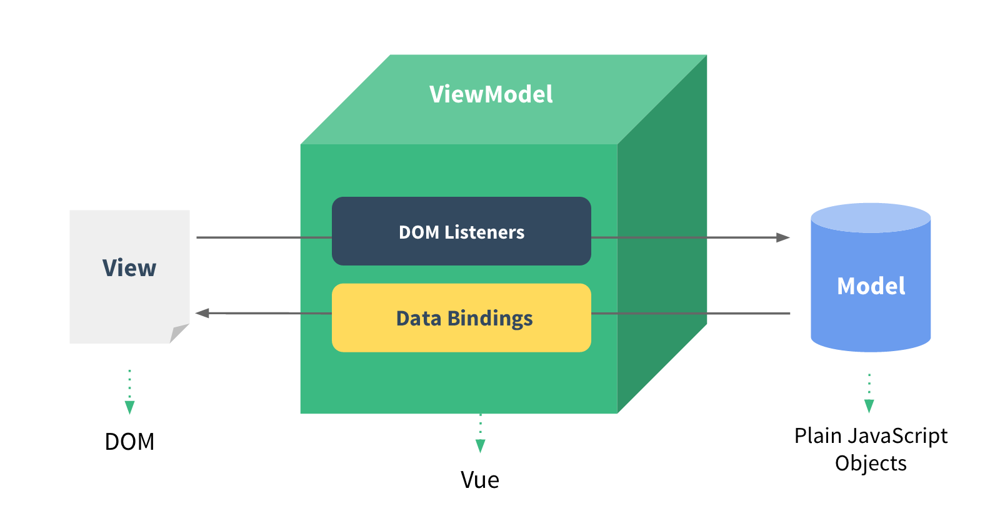

[TOC]

# 一、模板绑定
## 模板语法
1. 插值语法{{XXX}}

    解析标签体内容，XXX作为js表达式解析。

2. 指令语法

    解析标签属性、解析标签体内容、绑定事件。v-bind:href = 'xxxx'，xxxx作为js表达式解析。

## 数据绑定
1. 单向绑定

   数据只能从data流向页面，v-bind:href ="xxx" 或简写为 :href。
   
2. 双向绑定

    数据双向流动，v-mode:value="xxx" 或简写为 v-model="xxx"。

## MVVM



# 二、事件处理

## 绑定事件
语法：v-on:xxx，@xxx='functionName'，@xxx='functionName($event)'，xxx为事件名称。
示例：@click='demo',@click='demo($event)'

## 事件修饰符
语法：@click.stop="showInfo"
功能：
1. prevent：阻止默认事件（常用）；
2. stop：阻止事件冒泡（常用）；
3. once：事件只触发一次（常用）；
4. capture：使用事件的捕获模式；
5. self：只有event.target是当前操作的元素时才触发事件；
6. passive：事件的默认行为立即执行，无需等待事件回调执行完毕；

## 键盘事件
1.Vue中常用的按键别名：
   回车 => enter
   删除 => delete (捕获“删除”和“退格”键)
   退出 => esc
   空格 => space
   换行 => tab (特殊，必须配合keydown去使用)
   上 => up
   下 => down
   左 => left
   右 => right
2.Vue未提供别名的按键，可以使用按键原始的key值去绑定，但注意要转为kebab-case（短横线命名）

3.系统修饰键（用法特殊）：ctrl、alt、shift、meta
    (1).配合keyup使用：按下修饰键的同时，再按下其他键，随后释放其他键，事件才被触发。
    (2).配合keydown使用：正常触发事件。

4.也可以使用keyCode去指定具体的按键（不推荐）

5.Vue.config.keyCodes.自定义键名 = 键码，可以去定制按键别名

示例：
```html
<input type="text" placeholder="按下回车提示输入" @keydown.huiche="showInfo">
<script type="text/javascript">
   Vue.config.productionTip = false //阻止 vue 在启动时生成生产提示。
   Vue.config.keyCodes.huiche = 13 //定义了一个别名按键

   new Vue({
      el:'#root',
      data:{
      },
      methods: {
         showInfo(e){
            // console.log(e.key,e.keyCode)
            console.log(e.target.value)
         }
      },
   })
</script>
```

# 三、计算属性
computed：数据不存在，需要计算才得来，可以使用数据绑定显示。
```js
// 用法
<span>{{fullName}}</span>

const vm = new Vue({
   el:'#root',
   data:{
      firstName:'张',
      lastName:'三',
   },
   computed:{
      //完整写法
      /* fullName:{
          get(){
              console.log('get被调用了')
              return this.firstName + '-' + this.lastName
          },
          set(value){
              console.log('set',value)
              const arr = value.split('-')
              this.firstName = arr[0]
              this.lastName = arr[1]
          }
      } */
      //简写
      fullName(){
         console.log('get被调用了')
         return this.firstName + '-' + this.lastName
      }
   }
})
```

# 四、属性监视
> 监视属性的变化，默认监视层级为一层，内部改变不会触发。可以通过配置deep:true可以监测对象内部值改变（多层），也可以单独监视内部属性。

computed和watch之间的区别：
1. computed能完成的功能，watch都可以完成。
2. watch能完成的功能，computed不一定能完成，例如：watch可以进行异步操作。

```html
<div id="app">
    <span>{{isHot}}</span>
    <button @click="changeHot">切换Hot</button>

    <br/>
    <br/>

    <span>{{isTop}}</span>
    <button @click="changeTop">切换Top</button>
</div>
<script>
    var app = new Vue({
        el: '#app',
        data: {
            isHot: false,
            isTop: false
        },
        methods: {
            changeHot() {
                this.isHot = !this.isHot
            },
            changeTop() {
                this.isTop = !this.isTop
            }
        },
        // 方法一
        watch: {
            //简写
            /* isHot(newValue,oldValue){
               console.log('isHot被修改了',newValue,oldValue,this)
            } */
            isHot: {
                immediate: true, //初始化时让handler调用一下
                //handler什么时候调用？当isHot发生改变时。
                handler(newValue, oldValue) {
                    console.log('isHot被修改了', newValue, oldValue)
                }
            }
        }
    });

    // 方法二
    app.$watch('isTop', {
        immediate: true, //初始化时让handler调用一下
        //handler什么时候调用？当isHot发生改变时。
        handler(newValue, oldValue) {
            console.log('isTop被修改了', newValue, oldValue)
        }
    })
</script>
```

# 五、样式绑定
class样式：
   语法： :class='XXX' XXX可以是字符串、对象、数组

style样式：
   语法： :style='{XXX}'

```html
<div id="root">
   <!-- 绑定class样式--字符串写法，适用于：样式的类名不确定，需要动态指定 -->
   <div class="basic" :class="mood" @click="changeMood">{{name}}</div> <br/><br/>

   <!-- 绑定class样式--数组写法，适用于：要绑定的样式个数不确定、名字也不确定 -->
   <div class="basic" :class="classArr">{{name}}</div> <br/><br/>

   <!-- 绑定class样式--对象写法，适用于：要绑定的样式个数确定、名字也确定，但要动态决定用不用 -->
   <div class="basic" :class="classObj">{{name}}</div> <br/><br/>

   <!-- 绑定style样式--对象写法 -->
   <div class="basic" :style="styleObj">{{name}}</div> <br/><br/>
   <!-- 绑定style样式--数组写法 -->
   <div class="basic" :style="styleArr">{{name}}</div>
</div>
<script type="text/javascript">
   Vue.config.productionTip = false

   const vm = new Vue({
      el:'#root',
      data:{
         name:'尚硅谷',
         mood:'normal',
         classArr:['atguigu1','atguigu2','atguigu3'],
         classObj:{
            atguigu1:false,
            atguigu2:false,
         },
         styleObj:{
            fontSize: '40px',
            color:'red',
         },
         styleObj2:{
            backgroundColor:'orange'
         },
         styleArr:[
            {
               fontSize: '40px',
               color:'blue',
            },
            {
               backgroundColor:'gray'
            }
         ]
      },
      methods: {
         changeMood(){
            const arr = ['happy','sad','normal']
            const index = Math.floor(Math.random()*3)
            this.mood = arr[index]
         }
      },
   })
</script>
```

# 六、结构语句

## 条件语句
1. v-if
语法：
   v-if='表达式'
   v-else-if='表达式'
   v-else='表达式'
功能：适用于切换频率较低场景，不展示的DOM会被删除，以上可以组合使用，但是不能被打断。

2. v-show
语法：v-show='表达式'
功能：切换频率高，不展示DOM未被删除而是被隐藏。v-show可元素可以被获取。

## 列表渲染
1. v-for
语法：`<li v-for='(p, index) in person' :key='index' />`

# 七、过滤器
> 对要显示的数据进行格式化渲染。

语法：
   - 注册：`Vue.filter(name,callback)` 或 `new Vue{filters:{}}`
   - 使用：`{{ xxx | 过滤器名}}`  或  `v-bind:属性 = "xxx | 过滤器名"` 或  `v-bind:属性 = "xxx | 过滤器名1| 过滤器名2"`

# 八、常用指令
1. v-text : 更新元素的 textContent
2. v-html : 更新元素的 innerHTML
3. v-if : 如果为 true, 当前标签才会输出到页面
4. v-else: 如果为 false, 当前标签才会输出到页面
5. v-show : 通过控制 display 样式来控制显示/隐藏
6. v-for : 遍历数组/对象
7. v-on : 绑定事件监听, 一般简写为@
8. v-bind : 绑定解析表达式, 可以省略 v-bind
9. v-model : 双向数据绑定
10. v-cloak : 防止闪现, 与 css 配合: [v-cloak] { display: none }

# 九、自定义指令
```js
Vue.directive('my-directive', function(el, binding){ el.innerHTML = binding.value.toupperCase() })
// 使用
v-my-directive='xxx'
```

# 十、生命周期
常用生命周期方法：mounted，beforeDestory


# 十一、模块组件化
使用组件三大步骤：定义组件，注册组件，使用组件
1. 定义组件
```js
const hello = Vue.extend({
   template:`
       <div class="demo">
           <h2>学校名称：{{schoolName}}</h2>
           <h2>学校地址：{{address}}</h2>
           <button @click="showName">点我提示学校名</button>	
       </div>
   `,
   // el:'#root', //组件定义时，一定不要写el配置项，因为最终所有的组件都要被一个vm管理，由vm决定服务于哪个容器。
   data(){
      return {
         schoolName:'尚硅谷',
         address:'北京昌平'
      }
   },
   methods: {
      showName(){
         alert(this.schoolName)
      }
   }
})
```

2. 注册组件
```js
// 全局注册
Vue.component('hello',hello)

// 局部注册
new Vue({
   el:'#root',
   data:{
      msg:'你好啊！'
   },
   //第二步：注册组件（局部注册）
   components:{
      school,
      student
   }
})
```

3. 使用组件
```html
<div id="root">
   <hello></hello>
</div>
```


# 十二、组件数据共享

## 1.父子数据共享

> 需要子组件用props自定义属性。

```vue
<!--父组件 Avue.vue-->
<script>
export default {
  components: {
    Bvue
  },
  data() {
    return {
      msg: 'Hello child!',
      info: {name:'admin', age:18}
    }
  },
}
</script>

<template>
<Bvue :msg="msg" :info="info"/>
</template>

<!--子组件 Bvue.vue-->
<script>
export default {
  data() {
    return {
     
    }
  },
  props: ['msg', 'info']
}
</script>

<template>
	<div>
	  <p>{{ msg }}</p>
 	  <p>{{ info }}</p>
  </div>
</template>
```


## 2.子父数据共享

```vue
<!--父组件 Avue.vue-->
<script>
export default {
  components: {
    Bvue
  },
  data() {
    return {
      msg: ''
    }
  },
  methods:{
    setMesg(vul){
      this.msg = vul
    }
  }
}
</script>

<template>
	<Bvue @setMsg='setMsg'/>
</template>

<!--子组件 Bvue.vue-->
<script>
export default {
  data() {
    return {
     msgData: 'Hello Prent!'
    }
  },
  methods:{
    addMsg(){
      this.$emit('setMsg', this.msgData)
    }
  }
}
</script>

<template>
</template>
```


## 3.兄弟间传值

```vue
<!--组件 Avue.vue-->
<script>
  import bus from "./EventBus.js"

  export default {
    data() {
      return {
        msg: ''
      }
    },
    methods: {
      setMesg(vul) {
        // 监听事件，被触发事件
        this.msg = this.$on('sendMsg', vul => {
          this.msg = vul
        })
      }
    }
  }
</script>

<!--组件 Bvue.vue-->
<script>
  import bus from "./EventBus.js"

  export default {
    created(){
        // 发送数据触发事件
        this.$emit('sendMsg', this.msgData)
    },
    data() {
      return {
        msgData: 'Hello Prent!'
      }
    }
  }
</script>

```


```javascript
<!--EventBus.js-->
import Vue from 'vue'
// 向外共享 Vue 的实例对象
export default new Vue()
```

> 也可以使用PubSub.js代替这种方法


## 4.ref


