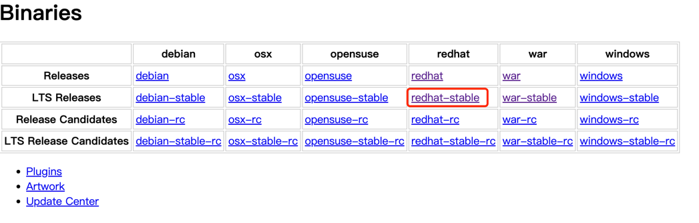

# 一、安装

## 1. 安装Jenkins
> 环境：
> 
> CentOS：8.0
> 
> Jdk：1.8
> 
> Jenkins：2.164-1.1

1.下载内容
> https://www.jenkins.io/download/



2.安装
> rpm -ivh jenkins-2.387.3-1.1.noarch.rpm

3.查看路径
> systemctl status jenkins


> 可以修改jdk路径

4.修改配置
> vim /usr/lib/systemd/system/jenkins.service


5.重新加载配置
> systemctl daemon-reload

6.开放端口
> firewall-cmd --zone=public --add-port=9001/tcp --permanent
> firewall-cmd --reload

7.查看密码
> /var/lib/jenkins/secrets/initialAdminPassword


8.登录管理员账号密码后卡在白色页面
> 访问：https://192.168.0.124:9001/pluginManager/advanced


> 重启即可：https://192.168.0.124:9001/restart

9.修改镜像源
```shell
cd /var/lib/jenkins/updates

sed -i 's/https:\/\/updates.jenkins.io\/download/https:\/\/mirrors.tuna.tsinghua.edu.cn\/jenkins/g' default.json && sed -i 's/http:\/\/www.google.com/https:\/\/www.baidu.com/g' default.json
```

修改Update Site


> 重启即可：https://192.168.0.124:9001/restart


10.卸载
```shell
# 停止jenkins服务
[root@CentOS8 ~]# systemctl stop jenkins
 
# 停止jenkins开机启动服务
[root@CentOS8 ~]# systemctl disable jenkins
 
# yum卸载jenkins
[root@CentOS8 ~]# yum -y remove jenkins
 
# 删除jenkins相关文件
[root@CentOS8 ~]# rm -rf /var/{lib,log,cache}/jenkins /usr/lib/jenkins /root/.jenkins
[root@CentOS8 ~]# rm -rf `sudo find /{etc,var,run} -name "jenkins*"`
```


## 2. 安装Maven

./bin/jlink --module-path jmods --add-modules java.desktop --output jre
