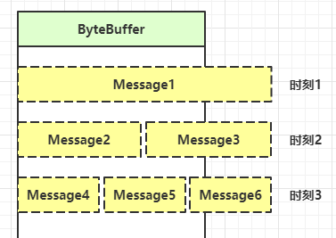

[TOC]

# 1. 三大组件

## 1.1 Channel

> 他是读写数据的双向通道，可以从通道读数据，也可以将数据写入通道内。

常见的channel：

1. FileChannel
2. DatagramChannel
3. SocketChannel
4. ServerSocketChannel

## 1.2 Buffer

> 主要用来缓存读写数据，可从Channel中读写数据

常见buffer：

* ByteBuffer
    * MappedByteBuffer
    * DirectByteBuffer
    * HeapByteBuffer
* ShortBuffer
* IntBuffer
* LongBuffer
* FloatBuffer
* DoubleBuffer
* CharBuffer

## 1.3 Selector

> 类似一个管家，它可以同时管理多个channel，这样就不会导致线程被单个channel阻塞，在非阻塞下，也不会导致线程无意义消耗。
> 他会根据不同事件，响应对应操作。

# 2. Buffer使用

> Buffer并非线程安全

示例：[读取文件](https://github.com/StackYu/example/blob/main/src/main/java/com/stackyu/example/nio/buffer/BufferTest.java)

## 2.1 Buffer结构

重要属性：`capacity`、`position`、`limit`

初始状态：


写入四字节后属性状态：


切换读模式：


读取4个字节后状态：


clear后状态：


compact执行后状态：


## 2.2 Buffer常用方法

### 1.分配空间：`allocate`

`Bytebuffer buf = ByteBuffer.allocate(10);`

### 2.写入数据：

channel写入：`channel.read(buf)`

put方法：`buf.put((byte)127)`

### 3.读数据：

channel读：`channel.write(buf)`

put方法：`buf.get()`

> get方法是一次性的，`position`会向前移动，可以调用重载方法`get(int index)`,也可以调用`rewind`方法将`position`重置0位置。

### 4.切换模式：

clear：清空内容，`capacity=容量`、`position=0`、`limit=容量`

flip：切换读模式，`capacity=容量`、`position=0`、`limit=内容size`

### 5.`mark`和`reset`

> mark在读时调用，即使position改变，但是调用reset还是会回到mark位置
>
> <b>注意：</b>rewind 和 flip 都会清除 mark 位置

### 6.字节字符Buffer装换

```java
// 字符转字节：
ByteBuffer buffer1 = StandardCharsets.UTF_8.encode("你好");
ByteBuffer buffer2 = Charset.forName("utf-8").encode("你好");

// 字节转字符
CharBuffer buffer3 = StandardCharsets.UTF_8.decode(buffer1);
```

# 3. 文件操作

## 3.1 FileChannel

获得channel：

* 通过 FileInputStream 获取的 channel 只能读
* 通过 FileOutputStream 获取的 channel 只能写
* 通过 RandomAccessFile 是否能读写根据构造 RandomAccessFile 时的读写模式决定

关闭channel：

* 关闭FileInputStream、FileOutputStream、RandomAccessFile会间接的关闭channel

使用transferTo进行拷贝：[transFormTo进行拷贝](https://github.com/StackYu/example/blob/main/src/main/java/com/stackyu/example/nio/buffer/BufferTest.java)
> 拷贝大文件效率高

## 3.2 Path

> Path表示文件或路径，是1.7之后引入，Paths工具类。

获得Path：`Paths.get("data.txt");`

路径正常化：

```java
Path path = Paths.get("d:\\data\\projects\\a\\..\\b");
System.out.

println(path);
// d:\data\projects\a\..\b

// 正常化路径
System.out.

println(path.normalize());
// d:\data\projects\b
```

## 3.3 Files

检查文件是否存在：

```java
Path path = Paths.get("data.txt");
System.out.

println(Files.exists(path)); 
```

创建一级目录：

```java
Path path = Paths.get("helloword/d1");
Files.

createDirectory(path);
```

> 如果目录已有，抛出异常FileAlreadyExistsException
>
> 一次创建多级目录，则会抛出异常NoSuchFileException

创建多级目录：

```java
Path path = Paths.get("helloword/d1/d2");
Files.

createDirectories(path);
```

拷贝文件：

```java
Path source = Paths.get("helloword/data.txt");
Path target = Paths.get("helloword/target.txt");

Files.

copy(source, target);
```

> 文件已存在则会抛出异常FileAlreadyExistsException

如果需要覆盖target文件：`Files.copy(source, target, StandardCopyOption.REPLACE_EXISTING);`

移动文件：

```java
Path source = Paths.get("helloword/data.txt");
Path target = Paths.get("helloword/data.txt");

Files.

move(source, target, StandardCopyOption.ATOMIC_MOVE);
```

> `StandardCopyOption.ATOMIC_MOVE`确保文件的移动原子性


删除目录或文件：

```java
Path target1 = Paths.get("helloword/target.txt");
Path target2 = Paths.get("helloword/d1");

Files.

delete(target1);
Files.

delete(target2);
```

> 如果文件不存在，则会抛出异常`NoSuchFileException`
>
> 如果目录还有内容，会抛异常`DirectoryNotEmptyException`

遍历文件：`Files.walkFileTree`

[遍历目录文件示例](https://github.com/StackYu/example/blob/main/src/main/java/com/stackyu/example/nio/buffer/BufferTest.java)

[文件数量统计示例](https://github.com/StackYu/example/blob/main/src/main/java/com/stackyu/example/nio/buffer/BufferTest.java)

# 4. 网络编程

## 4.1 阻塞Socket

[阻塞单线程Socket示例](https://github.com/StackYu/example/tree/main/src/main/java/com/stackyu/example/nio/socket/block)

## 4.2 非阻塞Socket

> 在阻塞情况下，线程会被暂停。只有等到阻塞结束才可后续工作。channel和buffer可以通过`configureBlocking`方法进行设置。

[非阻塞模式示例]()

在以上示例中，线程虽然不会阻塞，但是无限循环不会停止，一直在循环做无用功。如果出现问题可能导致功能失效。

## 4.3 Selector

### 4.3.1 Selector监听Accept，Read

> 单线程可以配合Selector使用，使一个线程监听多个channel，这称之为多路复用。
> 
> **注意：多路复用仅适用于网络IO，文件IO无用。channel 必须工作在非阻塞模式。**

[多路复用处理accept示例]()

事件触发后，要么处理要么丢弃，否则会一直循环待处理。

### 4.3.2 Selector监听Write

> 监听写事件：非阻塞模式下，无法保证一次将缓冲区内数据写入channel，这时就需要监听write。
> 但是直接监听也会导致内存占用过高，所以写事件需要分步处理。
> 
> * 第一次直接写，未能写完，再注册write事件。
> * selector监听写事件，处理未完成写事件。

[监听写write事件示例]()

### 4.3.3 Selector多线程优化

> 利用多小线程优化selector
> 
> Runtime.getRuntime().availableProcessors()获得系统核数

[使用多线程优化Selector示例]()

### 4.3.4 UDP

> UDP像广播一样，无连接。发送方只管发送，不管接收方是否接收到。
> 
> server 这边的 receive 方法会将接收到的数据存入 byte buffer，但如果数据报文超过 buffer 大小，多出来的数据会被默默抛弃。

[UDP示例]()


# 5. NIO、AIO、BIO


# 常见问题

## 1. 半包和黏包

> 在网络传输中，可能会把一整部分拆分成多个部分，这就称为半包。
>
> 与之相反，将多个部分组合成一个部分，这就称之为黏包。

[解决黏包和半包问题](https://github.com/StackYu/example/blob/main/src/main/java/com/stackyu/example/nio/buffer/BufferTest.java)

## 2. 消息边界问题



> 在网络传输中，传输消息大小不一，无法统一长度。
> 
> 处理方法：
> 
> * 可以规定统一长度，但是会损失带宽。
> 
> * 一种是统一分隔符，这样会导致效率较低，处理繁琐。
> 
> * TLV 格式，即 Type 类型、Length 长度、Value 数据，类型和长度已知的情况下，就可以方便获取消息大小，分配合适的 buffer，缺点是 buffer 需要提前分配，如果内容过大，则影响 server 吞吐量。

[边界问题处理示例](https://github.com/StackYu/example/blob/main/src/main/java/com/stackyu/example/nio/socket/selector/SelectorReadServer2.java)
